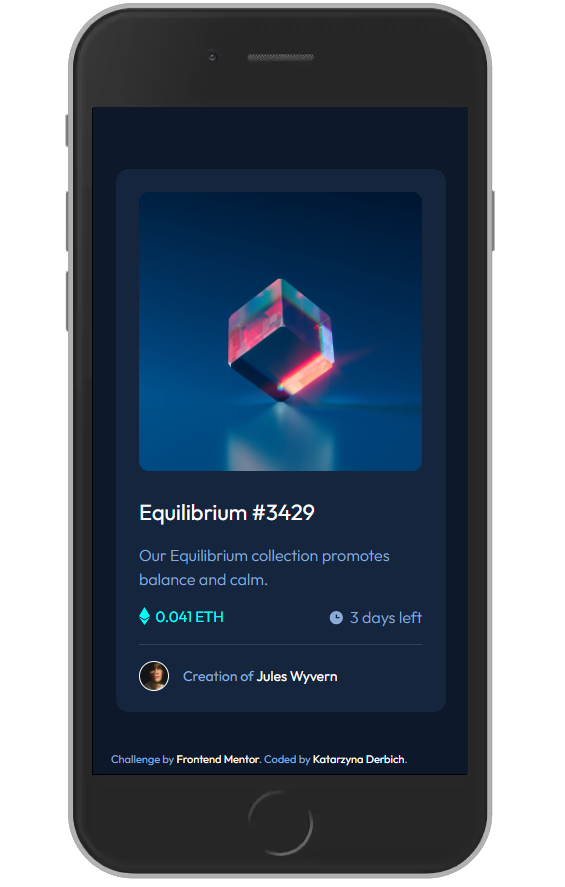
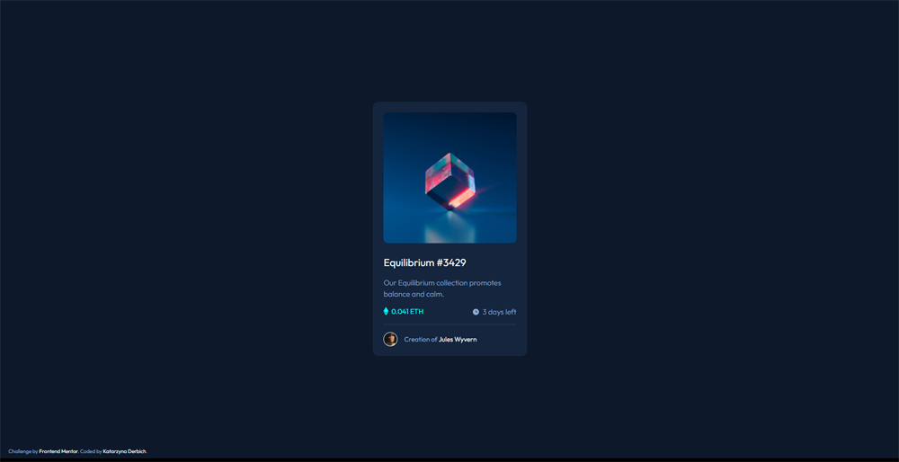

# Frontend Mentor - NFT preview card component solution

This is a solution to the [NFT preview card component challenge on Frontend Mentor](https://www.frontendmentor.io/challenges/nft-preview-card-component-SbdUL_w0U). Frontend Mentor challenges help you improve your coding skills by building realistic projects.

## Table of contents

- [Overview](#overview)
  - [The challenge](#the-challenge)
  - [Screenshots](#screenshots)
  - [Links](#links)
- [My process](#my-process)
  - [Built with](#built-with)
  - [What I learned](#what-i-learned)
- [Author](#author)

## Overview

### The challenge

Users should be able to:

- View the optimal layout depending on their device's screen size
- See hover states for interactive elements

### Screenshots

- Mobile Solution (375px width):

  

- Desktop Solution (1920px width):

  

### Links

- Solution URL: [GitHub Solution](https://github.com/belie369/frontend-mentor-nft-preview-card)
<!-- - Live Site URL: [Add live site URL here](https://your-live-site-url.com) -->

## My process

### Built with

- Semantic HTML5 markup
- CSS
- SASS SCSS with variables
- BEM methodology
- Flexbox
- Mobile-first workflow

### What I learned

- I needed to plan all the things before writing anything.
- I learned how to measure layouts using Photoshop.
- I have systematized my knowledge of the BEM methodology.

## Author

- Website - [katarzynaderbich.pl](http://katarzynaderbich.pl/)
- Frontend Mentor - [@belie369](https://www.frontendmentor.io/profile/belie369)
- Twitter - [@belie369](https://www.twitter.com/belie369)
